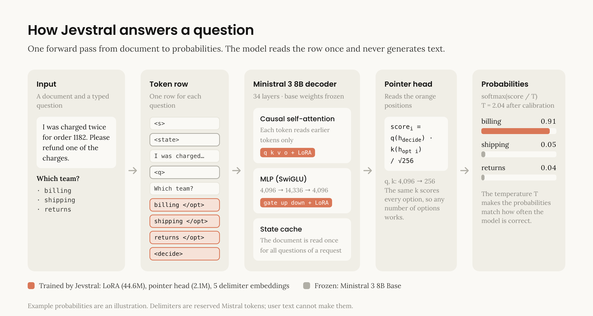
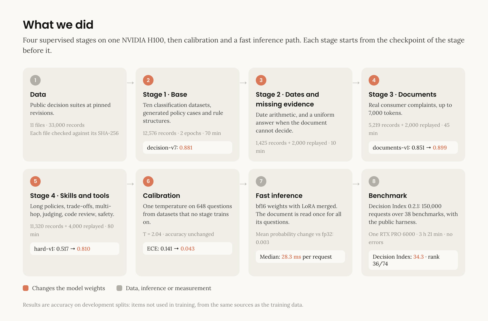
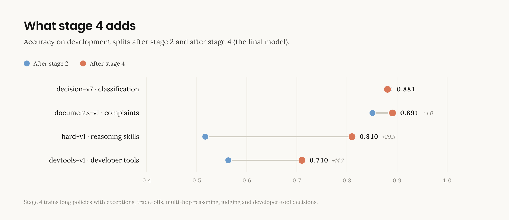
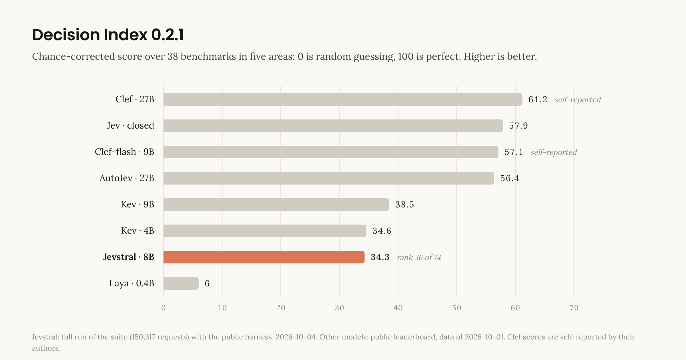
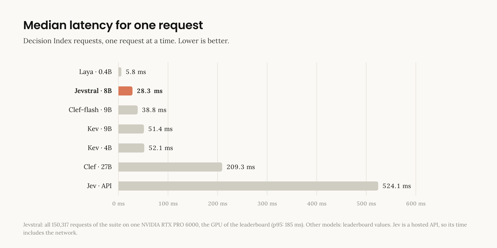

# Jevstral

> **Disclaimer.** Jevstral is an independent personal project. It is not affiliated with, endorsed by or sponsored by Mistral AI. "Mistral" and "Ministral" are names of Mistral AI. Jevstral uses the open-weight model `mistralai/Ministral-3-8B-Base-2512`, which Mistral AI publishes under the Apache 2.0 license. Jevstral is also not affiliated with TypeSafe, the company that makes Jev.

Jevstral is a decision model. It reads a document and a set of typed questions, and it gives a calibrated probability for each option of each question. It does this in one forward pass. It does not generate text.

Example: a support ticket and the question "Which team?" with the options `billing`, `shipping` and `returns`. Jevstral gives one probability for each option. Software can then act on a threshold. For example: if p ≥ 0.9, send the ticket to the team automatically; if not, send it to a person.

- **Weights:** [AmirBraham/jevstral-8b](https://huggingface.co/AmirBraham/jevstral-8b) on Hugging Face. Use the `stage4/` folder.
- **License:** Apache 2.0.

## Contents

1. [How it works](#1-how-it-works)
2. [Training](#2-training)
3. [Results](#3-results)
4. [Benchmarks](#4-benchmarks)
5. [Use the model](#5-use-the-model)
6. [Reproduce the training](#6-reproduce-the-training)
7. [Documents](#7-documents)
8. [License](#8-license)
9. [Credits](#9-credits)

## 1. How it works



Jevstral follows the decision-model design described in ["Jev's Architecture Unmasked"](https://archerhume.com/posts/jevs-architecture-unmasked).

1. **Token row.** Each question becomes one row of tokens: the document, the question and the options. Five reserved Mistral tokens mark the parts of the row. User text cannot make these tokens.
2. **Decoder.** The row goes through the Ministral 3 8B text decoder. Its 34 layers are frozen. LoRA adapters (rank 16) change the attention and MLP projections.
3. **Pointer head.** The head reads the hidden state at the end of each option and at the `<decide>` token. It gives one score for each option: `q(h_decide) · k(h_option) / √256`.
4. **Probabilities.** A softmax of `score / T` gives the probabilities. The temperature T = 2.04 makes the probabilities match how often the model is correct.
5. **State cache.** For a request with more than one question, the model reads the document once and uses it again for each question.

Each part has a short explanation in [`docs/concepts/`](docs/concepts/).

## 2. Training



| Step | Data | What the model learns | Time on one H100 |
|---|---|---|---|
| Stage 1 · Base | 12,576 records: ten classification datasets, generated policy cases and rule structures | The format and the basic decision skill | 70 min |
| Stage 2 · Dates and missing evidence | 1,425 records + 2,000 replayed | Date arithmetic, and a uniform answer when the document cannot decide | 10 min |
| Stage 3 · Documents | 5,219 consumer complaints + 2,000 replayed | Long, real documents | 45 min |
| Stage 4 · Skills and tools | 11,320 records + 4,000 replayed | Long policies, trade-offs, multi-hop reasoning, judging, developer tools | 80 min |
| Calibration | 648 questions from datasets that no stage trains on | One temperature, T = 2.04 | 5 min |

- **Data.** All training data comes from public decision suites at pinned revisions (see [Credits](#9-credits)). Each file is checked against its SHA-256 before training.
- **Replay.** Stages 2, 3 and 4 add records from stage 1. This prevents the model from forgetting its earlier skills.
- **Settings.** Cross-entropy loss, AdamW, one-cycle learning rate, gradient clipping at 1.0, fp32 weights with bf16 computation.
- **Trained weights.** 46.7 million: LoRA (44.6M), the pointer head (2.1M) and five delimiter embeddings. The 8 billion base weights do not change.

The results of each stage are in [docs/training-log.md](docs/training-log.md).

## 3. Results

These results are for the final model: the calibrated `stage4/` checkpoint.

### Accuracy

The model did not train on these items, but they come from the same sources as the training data. These are not benchmark results.

| Development set | Questions | Accuracy |
|---|---|---|
| `decision-v7`: classification and policy decisions | 1,468 | 0.881 |
| `documents-v1`: long consumer complaints | 920 | 0.891 |
| `hard-v1`: long policies, trade-offs, multi-hop, judging | 1,083 | 0.810 |
| `devtools-v1`: code review, commits, flaky tests, safety | 1,074 | 0.710 |



### Calibration

One temperature, fitted on 648 questions from datasets that no training stage uses. Calibration changes the confidence, not the answers.

| | Before | After |
|---|---|---|
| Expected calibration error | 0.141 | **0.043** |
| Log loss | 1.018 | **0.848** |
| Accuracy | 0.679 | 0.679 |

### Inference

The fast inference path uses bf16 weights with LoRA merged into the base weights. Against the fp32 training path on 567 development questions, the mean probability difference is 0.003, and 3 answers change.

## 4. Benchmarks

The [Decision Index 0.2.1](https://huggingface.co/spaces/multimodalart/jev-decision-index) is a public benchmark for decision models: 38 benchmarks in five areas. Each score is chance-corrected: 0 is random guessing, 100 is perfect. Jevstral ran the full suite (150,317 requests) with the [public harness](https://github.com/apolinario/decision-index) on one NVIDIA RTX PRO 6000, the GPU that the leaderboard uses. All requests were answered, with no errors, in 3 hours 21 minutes.

**Result: 34.3, rank 36 of 74.**



| Area (weight) | Jevstral 8B | Kev 4B | Kev 9B | Jev |
|---|---|---|---|---|
| Knowledge and reasoning (25.8 %) | **24.5** | 22.9 | 26.2 | 51.4 |
| Language understanding (25.8 %) | **34.6** | 35.3 | 41.7 | 62.0 |
| Retrieval and classification (20.0 %) | **39.3** | 41.0 | 43.7 | 55.4 |
| Tools and automation (18.3 %) | **52.9** | 52.6 | 54.5 | 75.1 |
| Arts and human taste (10 %) | **14.8** | 17.9 | 22.4 | 37.7 |
| **Decision Index** | **34.3** | 34.6 | 38.5 | 57.9 |



Latency on the full suite, one request at a time: median **28.3 ms**, p95 185 ms, mean 79 ms.

What the results show:

- Jevstral has the quality of Kev 4B (34.6), the model whose recipe it follows, on a Mistral backbone. It is better on knowledge and tools, and worse on language, retrieval and arts.
- Its median latency is lower than that of every model on this chart except Laya.
- The gap to Jev (57.9) is large in every area. Other open models show that most of this gap comes from training data, not model size.

Points to know when you compare the results:

- **Training overlap.** BANKING77 is in the Decision Index and in the training data of Jevstral and Kev.
- **Calibration data.** 200 MMLU-Pro questions were used to fit the temperature. MMLU-Pro is also in the Decision Index. The temperature does not change the answers.
- **Latency.** Jev is a hosted API, so its time includes the network.
- **Self-reported scores.** The Clef scores come from their authors.

The full results are in [`docs/benchmark/`](docs/benchmark/): `scores.json`, `index.json` and `benchmark-summary.json` (each benchmark, with its score and latency).

## 5. Use the model

You need an NVIDIA GPU with 24 GB of memory or more, and [uv](https://docs.astral.sh/uv/).

```
git clone https://github.com/AmirBraham/jevstral && cd jevstral
uv sync --group train
uv run hf download AmirBraham/jevstral-8b --include "stage4/final/*" --local-dir weights
```

```python
from pathlib import Path
from jevstral.inference import Predictor

predictor = Predictor(Path("weights/stage4/final"))  # also downloads Ministral 3 8B Base (approximately 17 GB)
probabilities = predictor(
    "I was charged twice for order 1182. Please refund one of the charges.",
    {
        "team": {
            "type": "choice",
            "instructions": "Which team should handle this?",
            "criteria": {"billing": "Charges and refunds", "shipping": "Deliveries", "returns": "Exchanges"},
        },
        "urgent": {"type": "noul", "instructions": "Does this need a reply today?"},
    },
)
print(probabilities)  # {"team": [p_billing, p_shipping, p_returns], "urgent": [p_no, p_yes]}
```

Question types:

| Type | Options | Output |
|---|---|---|
| `choice` | The named criteria | One probability for each criterion, in order |
| `noul` | `no`, `yes` | Two probabilities |
| `score` | Ordered levels | One probability for each level |

## 6. Reproduce the training

The local computer runs only the `modal` command. All data, model and GPU work runs on [Modal](https://modal.com).

```
uv sync
uv run modal setup
uv run modal secret create huggingface HF_TOKEN=<token with write access>
uv run modal secret create wandb WANDB_API_KEY=<key>
```

Prepare the data and do a short test run:

```
uv run modal run modal_app.py::prepare_data
uv run modal run modal_app.py::inspect_data
uv run modal run modal_app.py::train --stage 1 --smoke
```

Train the four stages and fit the temperature. `modal deploy` puts the app on Modal. Each command starts a job on the deployed app and returns at once, so the job does not depend on the local computer. Deploy again after each code change.

```
uv run modal deploy modal_app.py
uv run python modal_app.py train 1     # then 2, 3 and 4, each after the previous stage
uv run python modal_app.py calibrate
```

Back up a stage to Hugging Face, and run the Decision Index:

```
uv run modal run modal_app.py::publish --stage 4
uv run python modal_app.py build_suite
uv run modal run modal_app.py::bench_sample --n 100
uv run python modal_app.py bench_full
```

Training sends its loss, learning rate and gradient norm to the Weights & Biases project `jevstral`.

To render the figures in this README again: `scripts/render-figures.sh` (needs Google Chrome). The figure sources are in `docs/images/src/`.

## 7. Documents

- [`docs/concepts/`](docs/concepts/): how each part works (decision model, encoding, augmentation, pointer head, LoRA, training stages, calibration).
- [`docs/training-log.md`](docs/training-log.md): the results of each training stage.
- [`docs/specs/`](docs/specs/): the design.

## 8. License

Apache 2.0 for the code and the weights. See [LICENSE](LICENSE). The training datasets have their own licenses; see the dataset cards and the suite manifests.

## 9. Credits

- [Kev](https://github.com/jaredpalmer/kev): the method, the training recipe and the data. Jevstral is a port of Kev to a Mistral backbone. It is not affiliated with the author of Kev.
- ["Jev's Architecture Unmasked"](https://archerhume.com/posts/jevs-architecture-unmasked): the architecture analysis behind the design.
- [Decision Index](https://github.com/apolinario/decision-index): the benchmark suite and harness.
- [Mistral AI](https://mistral.ai): the open-weight base model, Ministral 3 8B Base (Apache 2.0).
